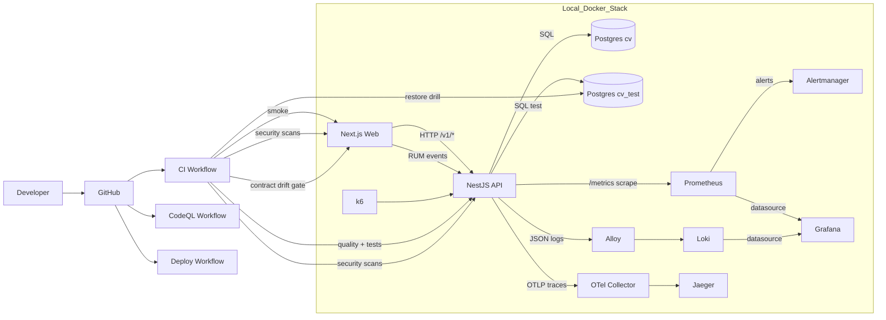

# CV Web Template Wrap-Up

## 1. Goal and Scope

This document summarizes the current template state before adding business logic and richer UI.

It covers:

- Implemented platform components
- Purpose of each component
- Dependency/synergy map
- Remaining gaps before full production readiness
- Manual validation plan for local Docker stack
- Manual validation plan for CI/pipeline behavior

---

## 2. Architecture at a Glance

---

## 3. Component Inventory and Purpose

## 3.1 Monorepo Baseline

Core files:

- `package.json`
- `package-lock.json`
- `apps/api`
- `apps/web`

Purpose:

- Single dependency graph and workspace orchestration
- Reproducible installs with `npm ci`

## 3.2 API Runtime Foundation (NestJS)

Core files:

- `apps/api/src/main.ts`
- `apps/api/src/app.module.ts`
- `apps/api/src/bootstrap/app-bootstrap.ts`

Implemented baseline:

- Security headers via `helmet`
- Explicit CORS allowlist/method/header controls
- Trust proxy strategy from typed config
- Request/body timeout policy from typed config
- Request body size limit from typed config
- Request ID middleware and response propagation
- Global response envelope and exception envelope
- Global HTTP logging interceptor
- Graceful shutdown hooks (`SIGINT`, `SIGTERM`)
- Rate limiting with `@nestjs/throttler`

## 3.3 Typed Config and Feature Flags

Core file:

- `apps/api/src/config/app.config.ts`

Consumers:

- Nest runtime
- TypeORM CLI datasource
- Tests (`jest.env.ts`)

Implemented:

- Fail-fast Zod validation for env variables
- Runtime feature flags via `FEATURE_FLAGS`
- Built-in flags:
  - `swagger_docs`
  - `rum_ingest`

Related files:

- `apps/api/src/modules/feature-flags/feature-flags.service.ts`
- `apps/api/src/modules/feature-flags/feature-flags.controller.ts`
- `apps/api/src/modules/feature-flags/feature-flags.module.ts`

Endpoint:

- `GET /v1/feature-flags`

## 3.4 Error Tracking (Deferred)

Current state:

- Dedicated Sentry-compatible error-tracking integration is intentionally deferred for now.
- No Sentry/GlitchTip runtime wiring is active in the template.

Planned target:

- Sentry-compatible event export with release tags
- Dedicated issue-management UI equivalent to production setup

## 3.5 Browser RUM Path

Web files:

- `apps/web/src/lib/rum.ts`
- `apps/web/src/components/rum-observer.tsx`
- `apps/web/src/app/layout.tsx`

API files:

- `apps/api/src/modules/rum/rum.dto.ts`
- `apps/api/src/modules/rum/rum.service.ts`
- `apps/api/src/modules/rum/rum.controller.ts`
- `apps/api/src/modules/rum/rum.module.ts`

Behavior:

- Web captures web-vitals, JS errors, and navigation events
- Web sends batched events to API (`sendBeacon` preferred)
- API validates and ingests events
- Ingest is controlled by feature flag `rum_ingest`

Endpoint:

- `POST /v1/rum/events`

## 3.6 Data Layer and Migrations

Core files:

- `apps/api/src/migrations/1770834553860-Init.ts`
- `apps/api/src/migrations/1771060000000-AsyncOutboxAndIdempotency.ts`
- `apps/api/src/typeorm.datasource.ts`
- `apps/api/src/config/typeorm.cli.config.ts`

DB separation:

- Runtime DB: `cv` (`postgres` service)
- Test DB: `cv_test` (`postgres_test` service)

Purpose:

- Prevent test contamination of runtime data
- Keep schema evolution explicit and replayable

## 3.7 Async Reliability Skeleton

Core files:

- `apps/api/src/modules/async/async.worker.service.ts`
- `apps/api/src/modules/async/idempotency.service.ts`
- `apps/api/src/modules/async/outbox.service.ts`
- `apps/api/src/modules/async/entities/*`
- `docs/async-patterns.md`

Implemented:

- Persistent idempotency store (`processed_messages`)
- Persistent outbox (`outbox_events`) with retry metadata
- Transport-agnostic worker contract for later Kafka/SQS adapters

## 3.8 Health, Metrics, and Operational Endpoints

Core files:

- `apps/api/src/modules/health/*`
- `apps/api/src/modules/metrics/*`

Endpoints:

- `GET /v1/health/live`
- `GET /v1/health/ready`
- `GET /metrics`

Purpose:

- Distinct liveness/readiness checks
- Prometheus-compatible metrics exposure

## 3.9 Observability Stack (Docker)

Core files:

- `docker/compose.yml`
- `docker/prometheus.yml`
- `docker/prometheus.rules.yml`
- `docker/prometheus.alerts.yml`
- `docker/alertmanager.yml`
- `docker/alertmanager.prod.yml`
- `docker/grafana/provisioning/**`
- `docker/alloy/config.alloy`
- `docker/loki/config.yml`
- `docker/otel-collector-config.yml`
- `docs/runbooks/*.md`
- `docs/observability.md`

Purpose:

- Metrics: Prometheus + Grafana
- Alerts: Prometheus rules -> Alertmanager routing
- Logs: Docker logs -> Alloy -> Loki -> Grafana
- Traces: OTEL -> Collector -> Jaeger

## 3.10 Web Baseline

Core files:

- `apps/web/src/app/page.tsx`
- `apps/web/src/app/health/page.tsx`
- `apps/web/e2e/smoke.spec.mjs`
- `apps/web/playwright.config.mjs`
- `apps/web/README.md`

Purpose:

- Minimal web shell
- API connectivity proof page
- Browser smoke coverage in CI

## 3.11 API Contract Discipline

Core files:

- `scripts/generate-api-contract.mjs`
- `apps/web/src/lib/api/generated.ts`
- `docs/api-contract.md`
- `.github/workflows/ci.yml` contract drift steps

Purpose:

- Keep frontend API contract synchronized with backend OpenAPI output
- Fail CI if generated contract is stale

## 3.12 Security and Supply Chain

Core files:

- `.github/workflows/ci.yml`
- `.gitleaks.toml`
- `.dockerignore`
- `apps/api/Dockerfile`
- `apps/web/Dockerfile`

Implemented:

- `npm audit` gate (high+ prod vulns)
- Trivy image scan for API and web
- SBOM generation and artifact upload
- Gitleaks secrets scan gate
- Non-root production images
- Production image npm/npx removal hardening

## 3.13 Governance and Release Hygiene

Core files:

- `docs/github-governance.md`
- `.github/workflows/commitlint.yml`
- `.github/workflows/release-please.yml`
- `.github/workflows/codeql.yml`
- `.github/dependabot.yml`

Purpose:

- Enforce required CI checks before merge
- Keep release metadata/versions consistent
- Keep dependency updates flowing

## 3.14 Deploy + IaC Skeleton

Core files:

- `.github/workflows/deploy.yml`
- `infra/terraform/*`
- `docs/deployment.md`

Current state:

- Functional deployment skeleton workflow exists
- Terraform baseline exists
- Full production deployability still requires ECS/ALB/Route53/ACM completion + real `apply` validation

---

## 4. Dependency and Synergy Map

1. `app.config.ts` is the central runtime contract.
2. Runtime, TypeORM CLI, and tests share that config and fail-fast behavior.
3. API metrics feed Prometheus recording rules and alerts.
4. Alert rules map to Alertmanager routes and runbook links.
5. Request IDs + trace IDs improve metrics/logs/traces correlation.
6. OpenAPI export drives generated web API contract and CI drift gate.
7. Test DB + migration flow keeps integration/e2e deterministic.
8. Outbox + idempotency persistence provides async reliability primitives.
9. Feature flags allow runtime toggles without code changes.
10. RUM extends observability into user/browser telemetry.
11. Branch protection enforces CI/security checks at merge time.

---

## 5. Current Status

## 5.1 Strong and Ready

- Typed config with environment validation and fail-fast behavior
- Security baseline in API bootstrap
- Separate test database strategy
- Split CI quality/integration/security/web-smoke jobs
- Contract drift gate in CI
- Supply-chain security gates (audit, Trivy, SBOM, gitleaks)
- Alert rules + runbooks + Alertmanager wiring
- Forced alert delivery validated end-to-end to real email channel
- Outbox/idempotency persistence and tests
- Backup/restore drill automation
- Feature flags and RUM ingest path
- Coverage gate enforced in CI (`@cv/api` global: 80% statements/branches/functions/lines)

## 5.2 Remaining Gaps for Full Production Readiness

- Terraform: complete ECS task/service, ALB, Route53/ACM wiring and validate with real `terraform apply`
- Deployment: execute and prove one full successful deployment in real AWS environment
- Rollback: document and rehearse concrete rollback runbook with evidence
- Dedicated error-tracking component (Sentry-compatible export + dedicated UI) is deferred and still missing

## 5.3 Cleanup Status

- Align `infra/terraform/README.md` wording with the current `infra/terraform/main.tf` implementation scope

---

## 6. Manual Test Plan A: Local Docker Validation

Goal: Verify each platform layer locally in Docker.

## 6.1 Boot stack

1. `docker compose -f docker/compose.yml up -d --build`
2. `docker compose -f docker/compose.yml ps`
3. Purpose: confirm stack boots deterministically.

## 6.2 API health baseline

1. `curl -sS http://localhost:3000/v1/health/live | jq`
2. `curl -sS http://localhost:3000/v1/health/ready | jq`
3. Purpose: verify liveness and dependency readiness.

## 6.3 Web -> API connectivity

1. Open `http://localhost:3001/health`
2. Confirm JSON health payload appears.
3. Purpose: verify web backend reachability.

## 6.4 Config fail-fast behavior

1. `docker compose -f docker/compose.yml stop api`
2. `docker compose -f docker/compose.yml run --rm -e DB_PORT=invalid api npm run start -w @cv/api`
3. Expect startup failure with validation error.
4. Purpose: prove invalid env is rejected early.

## 6.5 Metrics + recording rules

1. `curl -sS http://localhost:3000/metrics | head -n 30`
2. In Prometheus (`http://localhost:9090`) run:
   - `cv_api:http_rps:rate30s`
   - `cv_api:http_error_ratio:rate5m`
   - `cv_api:http_p95_seconds:5m`
3. Purpose: verify metric generation and rule evaluation.

## 6.6 Logs pipeline

1. Generate traffic:
   - `for i in $(seq 1 20); do curl -sS http://localhost:3000/v1/health > /dev/null; done`
2. In Grafana (`http://localhost:3002`), query Loki logs for `service="api"`.
3. Purpose: verify Alloy -> Loki -> Grafana flow.

## 6.7 Tracing pipeline

1. Generate traffic:
   - `for i in $(seq 1 20); do curl -sS http://localhost:3000/v1/health/ready > /dev/null; done`
2. In Jaeger (`http://localhost:16686`), inspect traces for service `cv-api`.
3. Purpose: verify OTEL trace export path.

## 6.8 Alerts route test

1. Open `ALERTS` in Prometheus expression browser.
2. Temporarily lower a threshold in `docker/prometheus.alerts.yml`.
3. Reload Prometheus, generate load, verify alert in Alertmanager (`http://localhost:9093`).
4. Confirm delivery in configured channel.
5. Purpose: verify rule -> route -> notification chain.

## 6.9 Test DB isolation + migrations

1. `docker compose -f docker/compose.yml --profile test up -d postgres_test api_test`
2. `DB_HOST=localhost DB_PORT=5433 DB_NAME=cv_test DB_USER=app DB_PASSWORD=app npm run migration:run -w @cv/api`
3. Purpose: verify isolated test schema lifecycle.

## 6.10 Integration + e2e + async persistence

1. `DB_HOST=localhost DB_PORT=5433 DB_NAME=cv_test DB_USER=app DB_PASSWORD=app npm run test:int -w @cv/api -- --watchman=false --detectOpenHandles`
2. `DB_HOST=localhost DB_PORT=5433 DB_NAME=cv_test DB_USER=app DB_PASSWORD=app npm run test:e2e -w @cv/api -- --watchman=false --detectOpenHandles`
3. Purpose: verify deterministic DB-backed tests and endpoint behavior.

## 6.11 Backup/restore drill

1. `./scripts/db-backup-restore-drill.sh`
2. Expect `Backup/restore drill passed`.
3. Purpose: verify recoverability, not just backup creation.

## 6.12 Contract generation + drift

1. `docker compose -f docker/compose.yml --profile test exec -T api_test sh -lc 'wget -qO- http://localhost:3000/docs-json' > artifacts/openapi.test.json`
2. `npm run contract:gen:web -- artifacts/openapi.test.json apps/web/src/lib/api/generated.ts`
3. `git diff -- apps/web/src/lib/api/generated.ts`
4. Purpose: verify backend-to-frontend API contract sync.

## 6.13 Web smoke tests

1. `WEB_BASE_URL=http://localhost:3001 npm run test:smoke -w web`
2. Purpose: verify browser-level baseline routes.

## 6.14 Feature flags runtime toggles

1. Run API with `FEATURE_FLAGS=swagger_docs=false,rum_ingest=true`
2. Confirm `/docs` is not exposed.
3. POST sample event to `/v1/rum/events` and confirm accepted response.
4. Purpose: verify runtime behavior controls.

## 6.15 Error tracking release tags

Deferred item (not implemented in current template):

1. Add Sentry-compatible error export from API.
2. Add dedicated error-tracking UI equivalent to production.
3. Validate release/environment tagging end-to-end.
4. Purpose: close the exception lifecycle gap before production hardening.

## 6.16 Browser RUM end-to-end

1. Set web env:
   - `NEXT_PUBLIC_RUM_ENABLED=true`
   - `NEXT_PUBLIC_RUM_ENDPOINT=http://localhost:3000/v1/rum/events`
2. Ensure API flag includes `rum_ingest=true`.
3. Browse app and check API logs for RUM ingest entries.
4. Purpose: verify browser telemetry ingestion.

## 6.17 Local security parity checks

1. `npm audit --omit=dev --audit-level=high`
2. `docker build -f apps/api/Dockerfile --target prod -t cv-api:local .`
3. `docker build -f apps/web/Dockerfile --target prod -t cv-web:local .`
4. `trivy image cv-api:local --severity HIGH,CRITICAL --ignore-unfixed`
5. `trivy image cv-web:local --severity HIGH,CRITICAL --ignore-unfixed`
6. `gitleaks detect --source . --no-git --redact --config .gitleaks.toml`
7. Purpose: match CI security expectations locally.

---

## 7. Manual Test Plan B: Pipeline Validation

Goal: verify CI/CD gates are enforcing the intended contract.

## 7.1 Trigger matrix

1. Open a PR from feature branch.
2. Confirm workflows run:
   - `CI`
   - `CodeQL`
   - `Commitlint`

## 7.2 CI job checks

### A) `quality`

1. Confirm install, lint, typecheck, build, and unit coverage pass.
2. Confirm `api-coverage` artifact uploaded.

### B) `secrets-scan`

1. Confirm gitleaks passes and report artifact uploaded.
2. Negative test: add synthetic secret pattern in temp branch and confirm failure.

### C) `integration-e2e`

1. Confirm compose test services boot.
2. Confirm readiness checks pass.
3. Confirm migration + integration + e2e pass.
4. Confirm OpenAPI export + contract regen + drift check pass.
5. Confirm backup/restore drill passes.
6. Confirm k6 smoke runs and uploads `k6-summary-test`.

### D) `security-supply-chain`

1. Confirm `npm audit` gate pass.
2. Confirm prod image builds pass.
3. Confirm Trivy pass for both images.
4. Confirm SBOM artifacts uploaded.

### E) `web-smoke`

1. Confirm compose web stack startup pass.
2. Confirm readiness wait pass.
3. Confirm Playwright smoke pass.

## 7.3 Branch protection policy check

1. Open repository `Settings` -> `Branches`.
2. Confirm required checks exactly match `docs/github-governance.md`.

## 7.4 CodeQL check

1. Confirm CodeQL executes on PR and on push to `main`.
2. Confirm Security tab receives scan results.

## 7.5 Deploy skeleton check

1. Trigger `Deploy (Skeleton)` manually for `dev`.
2. Confirm image build/push step passes.
3. Confirm deploy ECS steps execute.
4. Confirm post-deploy smoke hits configured URL.

## 7.6 Dedicated Error UI Validation (non-blocking CI companion)

Deferred until error-tracking integration is added:

1. Keep outside required CI jobs (stateful + account setup).
2. For release candidates, manually verify synthetic error events reach the production-equivalent error UI.
3. Purpose: ensure issue tracking remains operational across releases.

---

## 8. Exit Criteria Before Starting Domain Logic/UI

You can start adding business logic/UI once:

1. Local Plan A passes end-to-end at least once on clean checkout.
2. Pipeline Plan B passes on PR without manual reruns.
3. One forced alert is delivered end-to-end to your real channel.
4. Contract drift gate is proven by intentional API change test.
5. Backup/restore drill evidence is captured and repeatable.
6. Coverage gate remains green on PRs (`npm run test:cov -w @cv/api`).
